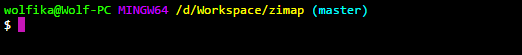

# zimap [](https://travis-ci.org/wolfika/zimap) [](https://coveralls.io/github/wolfika/zimap?branch=master)

> Gives stats about z-index leves used in your CSS




## Install

```
$ npm install --save zimap
```


## Usage

```js
const zimap = require('zimap');

zimap('./styles/main.css');
//=> Promise<Object>
```


## API

### zimap(filename)

#### filename

Type: `string`

Name of the file to give stats about.


## CLI

```
$ npm install --global zimap
```

```
$ zimap --help

Usage
	$ zimap [filename]

Examples
	$ zimap ./test/style.css
	{ count: 4, levels: [ 1, 10, 100, -1 ] }
```


## License

MIT © [Máté Farkas](https://github.com/wolfika)
